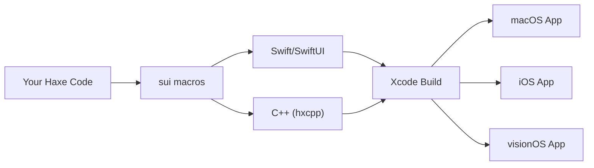

# sui

> Build native Apple apps in Haxe. &mdash; [GitHub](https://github.com/Pign/sui) | [Documentation](https://pign.github.io/sui/#/)

**sui** is a framework that lets you write SwiftUI applications entirely in Haxe. Your Haxe code compiles to C++ via hxcpp, bridges into Swift, and produces genuine native apps for macOS, iOS, iPadOS, and visionOS.

## Why sui?

- **Write Haxe** &mdash; Use the language you know: type inference, pattern matching, macros, and the full Haxe ecosystem.
- **Native SwiftUI** &mdash; Every view, modifier, and interaction maps directly to SwiftUI. No web views, no wrappers.
- **All Apple Platforms** &mdash; Target macOS, iOS, iPadOS, and visionOS from a single codebase.

## How It Works



## Quick Example

```haxe
import sui.App;
import sui.View;
import sui.ui.*;

class HelloApp extends App {
    static function main() {}

    public function new() {
        super();
        appName = "HelloHaxe";
        bundleIdentifier = "com.sui.helloworld";
    }

    override function body():View {
        return new VStack([
            new Text("Hello from Haxe!")
                .font(FontStyle.LargeTitle)
                .padding(),
            new Text("Running on macOS")
                .foregroundColor(ColorValue.Secondary),
            new Spacer(),
            new Text("Built with sui")
                .font(FontStyle.Caption)
                .foregroundColor(ColorValue.Gray)
        ]);
    }
}
```

## Get Started

- **[Getting Started](getting-started.md)** &mdash; Install, create a project, build, and run.
- **[Views](views/README.md)** &mdash; 40+ built-in views.
- **[Modifiers](modifiers.md)** &mdash; 58+ view modifiers reference.
- **[State](state/README.md)** &mdash; State management, bindings, and observables.
- **[Animations](animations.md)** &mdash; State-driven `.animation(curve, state)`, transitions, and curves.
- **[Bridge](bridge.md)** &mdash; Transparent Haxe/C++ bridge (automatic closures + explicit exports).
- **[Native Extensions](native-extensions.md)** &mdash; Custom Swift files and SPM packages.
- **[Examples](examples/README.md)** &mdash; 18 example apps.
