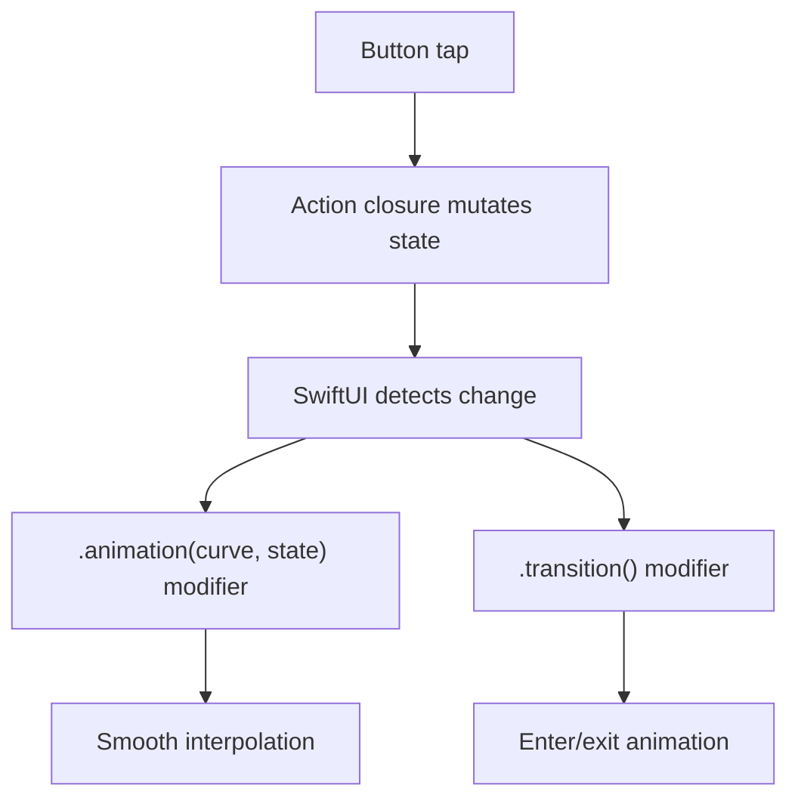

# Animations

sui provides two animation primitives that map to SwiftUI's animation system.

## Declaring Which State Animates a View

You don't animate an action &mdash; you declare, on the view, which `@:state` variable
drives its animation. Once that's set, *any* mutation of that state animates with the
chosen curve, including mutations that come back from Haxe through the bridge. Use the
`.animation(curve, state)` modifier with the `AnimationCurve` enum:

```haxe
@:state var scale:Float = 1.0;

new Text("Hello")
    .scaleEffect(scale)
    .animation(AnimationCurve.Spring, scale)

// The action stays a plain closure — no animation wrapper:
new Button("Bounce", () -> scale.value = scale.value == 1.0 ? 1.3 : 1.0)
```

When the closure sets `scale.value`, SwiftUI sees the change and animates the
`scaleEffect` with a spring. This generates:

```swift
Text("Hello")
    .scaleEffect(scale)
    .animation(.spring, value: appState.scale)

Button("Bounce") { /* dispatched closure mutates appState.scale */ }
```

> [!NOTE]
> The old `.animated(curve)` wrapper on actions has been removed. Animation is now a
> property of the *view*, not of the mutation. Move the curve from the action to an
> `.animation(curve, state)` modifier on the view whose appearance should animate.

### Animation Curves

Use the `AnimationCurve` enum for type-safe curve selection:

| Curve | Description |
|-------|-------------|
| `AnimationCurve.Default` | System default |
| `AnimationCurve.EaseIn` | Starts slow, speeds up |
| `AnimationCurve.EaseOut` | Starts fast, slows down |
| `AnimationCurve.EaseInOut` | Slow at both ends |
| `AnimationCurve.Spring` | Spring physics with overshoot |
| `AnimationCurve.Linear` | Constant speed |
| `AnimationCurve.Bouncy` | Playful bounce |

## The Animation Modifier

The `.animation()` modifier tells SwiftUI to animate a view when a `State<Float>` (or other `@:state`) reference changes. Use the `AnimationCurve` enum for the curve:

```haxe
@:state var scale:Float = 1.0;

new Text("Hello")
    .scaleEffect(scale)
    .animation(AnimationCurve.Spring, scale)
```

When `scale` changes &mdash; whether from a button closure or a value written back from
Haxe &mdash; the scale effect animates with a spring curve. Without the second parameter, all state changes trigger animation:

```haxe
new Text("Hello")
    .opacity(alpha)
    .animation(AnimationCurve.EaseInOut)
```

### Combining with State-Bound Modifiers

Visual effect modifiers accept `State<Float>` references for dynamic values. These are type-checked at compile time. Pair them with `.animation()` and the `AnimationCurve` enum for smooth transitions:

```haxe
@:state var cardScale:Float = 1.0;
@:state var cardRotation:Float = 0.0;
@:state var cardBlur:Float = 0.0;

new GroupBox("Card", [
    new Text("Animated!")
        .font(FontStyle.Title)
])
.scaleEffect(cardScale)
.rotationEffect(cardRotation)
.blur(cardBlur)
.animation(AnimationCurve.Spring, cardScale)
.animation(AnimationCurve.EaseInOut, cardRotation)
.animation(AnimationCurve.EaseOut, cardBlur)
```

Then mutate the state from a plain closure &mdash; the `.animation` modifiers above make the change animate:

```haxe
new Button("Bounce", () -> cardScale.value = cardScale.value == 1.0 ? 1.3 : 1.0)
```

## Transitions

The `.transition()` modifier defines how a view enters and exits when used inside a `ConditionalView`. Put an `.animation(curve, showDetail)` on the enclosing container so the enter/exit is animated:

```haxe
new Button("Show Detail", () -> showDetail.value = !showDetail.value)

new ConditionalView(showDetail,
    // Slides in from the edge
    new Text("Detail content")
        .padding()
        .background(ColorValue.Blue)
        .cornerRadius(12)
        .transition("slide"),

    // Fades out
    new Text("Tap to show detail")
        .transition("opacity")
)
```

### Transition Styles

| Style | Description |
|-------|-------------|
| `"opacity"` | Fade in/out |
| `"slide"` | Slide from leading edge |
| `"scale"` | Scale from small to full size |
| `"move"` | Move from an edge |
| `"push"` | Push old view out, new view in |

### How Animations Flow



### Important

Transitions only animate when the state that controls the `ConditionalView` is itself
bound to an `.animation` modifier on the enclosing container:

```haxe
// The container declares the animation; the closure just flips the bool:
new VStack([ /* ConditionalView with .transition()-tagged children */ ])
    .animation(AnimationCurve.Spring, visible);

new Button("Toggle", () -> visible.value = !visible.value)
```

Without an `.animation(curve, visible)` on the container, the view appears and disappears instantly.

## Full Example

```haxe
class AnimApp extends App {
    static function main() {}

    @:state var showDetail:Bool = false;
    @:state var scale:Float = 1.0;
    @:state var rotation:Float = 0.0;

    public function new() {
        super();
        appName = "Animations";
        bundleIdentifier = "com.sui.animations";
    }

    override function body():View {
        return new VStack(null, 30, [
            // Card whose transforms animate — the curves live here, on the view
            new Text("Hello!")
                .font(FontStyle.Title)
                .scaleEffect(scale)
                .rotationEffect(rotation)
                .animation(AnimationCurve.Spring, scale)
                .animation(AnimationCurve.Spring, rotation),

            // Buttons are plain closures; the mutations animate because of
            // the .animation modifiers above
            new HStack(null, 15, [
                new Button("Bounce", () -> scale.value = scale.value == 1.0 ? 1.3 : 1.0),
                new Button("Spin", () -> rotation.value += 90)
            ]),

            // Toggle whose transition is animated by the container's .animation
            new Button("Toggle Detail", () -> showDetail.value = !showDetail.value),

            new ConditionalView(showDetail,
                new Text("Detail!")
                    .padding()
                    .background(ColorValue.Blue)
                    .foregroundColor(ColorValue.White)
                    .cornerRadius(12)
                    .transition("slide")
            )
        ]).padding()
            .animation(AnimationCurve.Spring, showDetail);
    }
}
```

## Run It

```bash
cd examples/animations
haxelib run sui run macos
```
