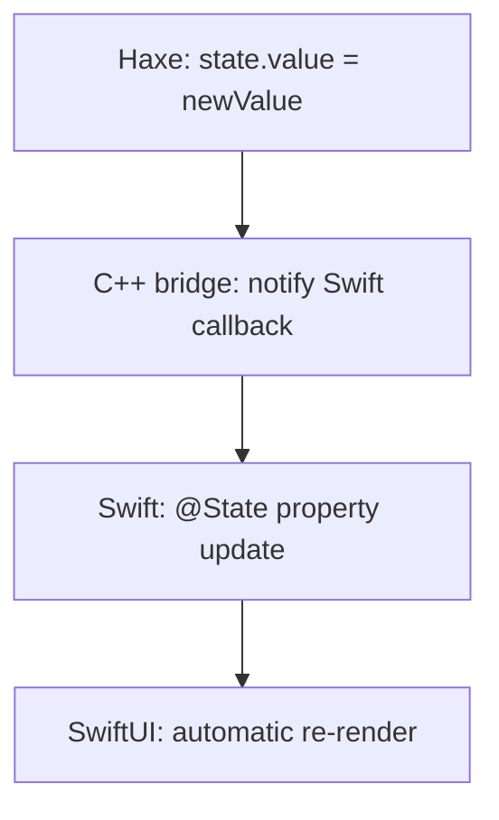
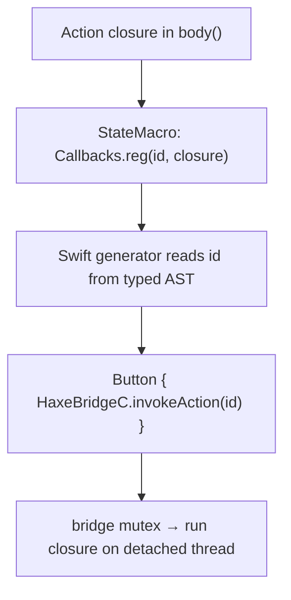
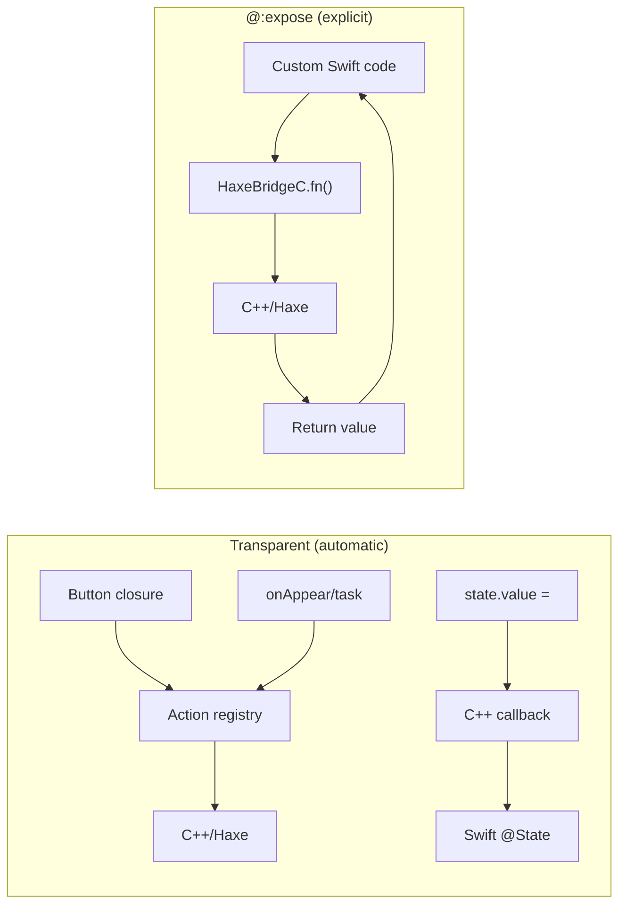

# Bridge

sui includes a **transparent bridge** between Swift and Haxe/C++. Most of the time, you just write normal Haxe code &mdash; closures, state updates, lifecycle handlers &mdash; and the framework handles the bridging automatically. No annotations required.

## Transparent Bridge (Automatic)

The most common bridge interactions require **zero configuration**. The framework detects closures and state usage in your view tree and wires up the C++ bridge for you.

### Button Closures

Pass any Haxe function or closure to a Button. It runs via the bridge automatically:

```haxe
new Button("Say Hello", () -> {
    myState.value = "Hello from Haxe! Time: " + Date.now().toString();
})
```

Under the hood, the framework registers the closure under a stable id and generates Swift code that calls `HaxeBridgeC.invokeAction(id)`. You never see this &mdash; it just works. See [Dispatch by id](#dispatch-by-id) below for the exact mechanism.

### State Updates

When you update a `@:state` variable from Haxe, the update flows back to SwiftUI automatically:



No annotation needed. Any `@:state` variable participates in this flow.

### Lifecycle Closures

`onAppear`, `onDisappear`, and `task` closures also bridge transparently:

```haxe
new VStack([...])
    .task(() -> {
        status.value = "Loading...";
        var http = new haxe.Http("https://example.com");
        http.onData = (d) -> data.value = d;
        http.request(false);
    })
    .onDisappear(() -> trace("View disappeared"))
```

These closures run in Haxe/C++ and can update `@:state` variables to push updates back to SwiftUI.

## Calling Haxe Business Logic from an Action

There is no special action variant for bridge calls anymore. To run Haxe/C++ logic,
just call the function inside the closure and assign its result to a state variable.
The closure already runs on a detached thread, so blocking work (HTTP, heavy compute)
is fine:

```haxe
// Synchronous call + assign
new Button("Greet", () -> result.value = greet("World"))

// Several arguments
new Button("Login", () -> result.value = doLogin("https://api.example.com", "user@email.com", "pass123"))

// Show a loading placeholder, then the result — SwiftUI sees both writes
new Button("Fetch Data", () -> {
    result.value = "Loading...";
    result.value = fetchUrl("https://example.com");
})

// Fire-and-forget (no return value)
new Button("Refresh", () -> refresh())
```

The function does not need `@:expose` to be called this way &mdash; it's an ordinary Haxe
call inside a Haxe closure.

## @:expose (Explicit Named Exports)

Use `@:expose` when you want to expose a **named static function** to Swift so that
*custom Swift code* (hand-written, outside the generated view) can call it by name as
`HaxeBridgeC.<fn>()`:

```haxe
@:expose
public static function greet(name:String):String {
    return 'Hello, $name! (from Haxe/C++)';
}
```

```swift
// In your own Swift code:
let msg = HaxeBridgeC.greet("World")
```

> [!NOTE]
> `@:expose` is no longer required for actions. Action closures call Haxe functions
> directly (see above) whether or not they are exposed. `@:expose` matters only when
> Swift you wrote yourself needs a named entry point into Haxe.

### When to Use @:expose

Use `@:expose` when you need to:
- Call a Haxe function from hand-written Swift code by name
- Get a return value back from Haxe into a custom Swift expression

You do **not** need `@:expose` for:
- Button / action closures (automatic)
- Calling a Haxe function from inside an action closure (ordinary Haxe call)
- `@:state` variable updates (automatic)
- Lifecycle closures like `onAppear`, `task`, `onDisappear` (automatic)

## Dispatch by id

Every action call site is rewritten by `StateMacro` so the closure is registered under
a **stable id** and dispatched from Swift &mdash; no Swift mutation code is generated for
the action itself.

- **Outside a `ForEach` row:** the macro rewrites the call site to
  `Callbacks.reg(<id>, closure)`. The closure is registered as the view tree is built;
  Swift dispatches it with `HaxeBridgeC.invokeAction(id)`.
- **Inside a `ForEach` row:** the macro lifts the closure into a static builder
  `(i0, i1) -> (() -> Void)` registered with `Callbacks.indexed(<id>, frames)`. Swift
  dispatches it with `HaxeBridgeC.invokeIndexedAction(id, i0, i1)`, passing the **live**
  loop indices so the closure operates on the right row.

The ids are stable hashes assigned at compile time and read straight from the typed AST
by the Swift generator &mdash; there is no parallel macro/runtime counter to keep in sync.
All dispatch is serialized by the bridge's global mutex.



## Write-Back: Swift → Haxe

Scalar `@:state` / AppState properties carry a `didSet` that replicates writes coming
from SwiftUI bindings (`TextField`, `Toggle`, `Slider`, `Picker`, …) back into the Haxe
mirror via `HaxeBridgeC.syncState` → `State._applyFromSwift`.

The practical consequence: inside an action closure, `someState.value` is **always
fresh**, even for a value the user just typed into a `TextField` and hasn't submitted
through any other path.

```haxe
new TextField("New item...", "newItemText"),
new Button("Add", () -> {
    // newItemText was written back by the TextField binding —
    // .value is up to date here
    if (newItemText.value != "") {
        todos.value = todos.value.concat([new TodoItem(newItemText.value)]);
        newItemText.value = "";
    }
})
```

## How It Works



The transparent bridge handles closures and state synchronization without any annotations. `@:expose` adds named entry points for when hand-written Swift code needs to call specific Haxe functions by name and get return values.

## Full Example

```haxe
class BridgeApp extends App {
    @:state var result:String = "Press a button!";

    public function new() {
        super();
        appName = "BridgeDemo";
        bundleIdentifier = "com.sui.bridgedemo";
    }

    // Haxe business logic, runs in C++. @:expose also makes it callable
    // by name from hand-written Swift as HaxeBridgeC.greet().
    @:expose
    public static function greet(name:String):String {
        return 'Hello, $name! (from Haxe/C++)';
    }

    @:expose
    public static function fibonacci(n:Int):Int {
        if (n <= 1) return n;
        return fibonacci(n - 1) + fibonacci(n - 2);
    }

    override function body():View {
        return new VStack(null, 20, [
            new Text("Haxe <-> Swift Bridge")
                .font(FontStyle.LargeTitle),
            Text.bind(result.value)
                .font(FontStyle.Title2)
                .padding(),

            // Action closures call the Haxe functions directly
            new Button("Greet from Haxe", () -> result.value = greet("World")),
            new Button("Fibonacci(20)", () -> result.value = 'fib(20) = ${fibonacci(20)}'),
        ]);
    }
}
```

## Multi-State Updates with State.setByName

When a bridge function needs to update multiple `@:state` variables, use `State.setByName()` from a closure:

```haxe
new Button("Login", () -> {
    State.setByName("status", "Logging in...");
    var result = doLogin(email.value, password.value);
    State.setByName("userName", result.name);
    State.setByName("mailboxCount", Std.string(result.mailboxes));
    State.setByName("isLoggedIn", "true");
    State.setByName("status", "Welcome!");
})
```

Each `setByName` call immediately pushes the value to SwiftUI. This is the same mechanism that `.value =` uses internally, but lets you target any state variable by name without needing a direct reference to the `@:state` variable.

## Complex Types: Shared Memory Bridge

Arrays and objects stay in Haxe memory &mdash; Swift reads them directly via shared-memory queries instead of serializing copies.

### Array State

`@:state` arrays are automatically exposed to Swift as computed properties that read from hxcpp:

```haxe
@:state var emails:Array<String> = [];

// Update in a closure — Swift sees the change immediately
new Button("Fetch", () -> {
    emails.value = fetchEmails();
})
```

SwiftUI renders with typed access &mdash; `Array<Int>` elements pass as `int32_t` directly, no string conversion.

### Object Arrays

For arrays of objects, Swift can query individual fields without copying the entire object:

```haxe
@:state var users:Array<Dynamic> = [];

// Populate with structured data
new Button("Load", () -> {
    users.value = [
        {name: "Alice", age: 30, active: true},
        {name: "Bob", age: 25, active: false},
    ];
})
```

The generated Swift queries fields on demand:
```swift
// Generated — reads directly from hxcpp memory
HaxeBridgeC.objectField("users", at: index, field: "name")    // → String
HaxeBridgeC.objectIntField("users", at: index, field: "age")  // → Int (no serialization)
HaxeBridgeC.objectBoolField("users", at: index, field: "active") // → Bool
```

### Why Shared Memory?

| | String serialization | Shared memory |
|--|--|--|
| Data copies | Full copy per update | Zero &mdash; reads from hxcpp |
| Int/Float/Bool | String round-trip | Native types, no conversion |
| Object fields | Serialize entire object | Query single field on demand |
| Memory | Two copies (Haxe + Swift) | One copy (Haxe only) |
| Mutations | Must re-serialize | Visible immediately |

## Key Points

- **Most bridging is automatic** &mdash; closures and `@:state` updates just work
- Actions are plain `() -> Void` closures, dispatched by stable id (`invokeAction` / `invokeIndexedAction`)
- To run Haxe logic from an action, just call the function in the closure &mdash; no `@:expose` needed
- `@:expose` is only needed for named function exports callable from hand-written Swift; they must be `public static`
- `@:expose` functions can accept and return basic types (`String`, `Int`, `Float`, `Bool`)
- SwiftUI binding writes mirror back into Haxe via `didSet`, so `state.value` is always fresh in a closure
- Arrays and objects use shared memory &mdash; no serialization overhead
- For a loading placeholder, write the placeholder then the result in the same closure
- Use `State.setByName()` to update multiple `@:state` variables from a single closure
