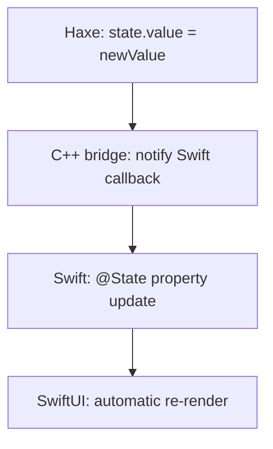
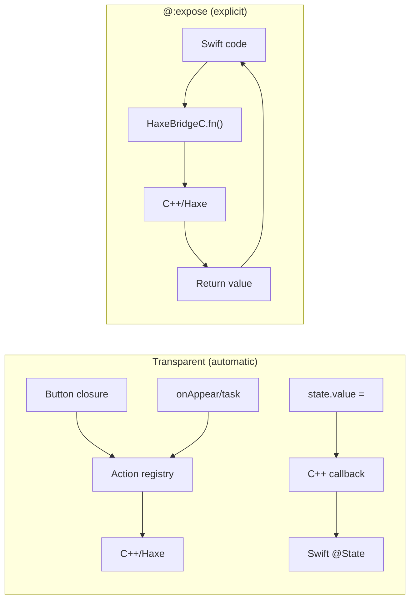

# Bridge

sui includes a **transparent bridge** between Swift and Haxe/C++. Most of the time, you just write normal Haxe code &mdash; closures, state updates, lifecycle handlers &mdash; and the framework handles the bridging automatically. No annotations required.

## Transparent Bridge (Automatic)

The most common bridge interactions require **zero configuration**. The framework detects closures and state usage in your view tree and wires up the C++ bridge for you.

### Button Closures

Pass any Haxe function or closure to a Button. It runs via the bridge automatically:

```haxe
new Button("Say Hello", () -> {
    myState.value = "Hello from Haxe! Time: " + Date.now().toString();
})
```

Under the hood, the framework registers the closure in an action registry and generates Swift code that calls `HaxeBridgeC.invokeAction(id)`. You never see this &mdash; it just works.

### State Updates

When you update a `@:state` variable from Haxe, the update flows back to SwiftUI automatically:



No annotation needed. Any `@:state` variable participates in this flow.

### Lifecycle Closures

`onAppear`, `onDisappear`, and `task` closures also bridge transparently:

```haxe
new VStack([...])
    .task(() -> {
        status.value = "Loading...";
        var http = new haxe.Http("https://example.com");
        http.onData = (d) -> data.value = d;
        http.request(false);
    })
    .onDisappear(() -> trace("View disappeared"))
```

These closures run in Haxe/C++ and can update `@:state` variables to push updates back to SwiftUI.

## @:expose (Explicit Named Exports)

Use `@:expose` when you want to expose a **named static function** to Swift, so you can call it from `StateAction.CustomSwift`, `BridgeCall`, or `BridgeCallLoading`:

**With @:expose:**
```haxe
@:expose
public static function greet(name:String):String {
    return 'Hello, $name! (from Haxe/C++)';
}

// Called by name from Swift:
new Button("Greet", null,
    StateAction.CustomSwift('result = HaxeBridgeC.greet("World")'))
```

**Without @:expose (closure equivalent):**
```haxe
// No annotation — just use a closure
new Button("Greet", () -> {
    result.value = 'Hello, World! (from Haxe/C++)';
})
```

The `@:expose` version is useful when you need the return value in a Swift expression, or when you want to reuse the same function from multiple call sites. The closure version is simpler when you just need to run Haxe logic and update state.

### When to Use @:expose

Use `@:expose` when you need to:
- Call a Haxe function from a `StateAction.CustomSwift` expression
- Use `StateAction.BridgeCall` or `BridgeCallLoading`
- Get a return value back from Haxe into a Swift expression

You do **not** need `@:expose` for:
- Button closures (automatic)
- `@:state` variable updates (automatic)
- Lifecycle closures like `onAppear`, `task`, `onDisappear` (automatic)

## Calling @:expose Functions

### From StateAction.CustomSwift

```haxe
// With @:expose — calls greet() by name in Swift
new Button("Greet", null,
    StateAction.CustomSwift('result = HaxeBridgeC.greet("World")'))

// Without @:expose — same logic via closure
new Button("Greet", () -> {
    result.value = 'Hello, World! (from Haxe/C++)';
})
```

### With BridgeCall

```haxe
// Single argument
new Button("Greet", null,
    StateAction.BridgeCall("result", "greet", "World"))

// Multiple arguments
new Button("Login", null,
    StateAction.BridgeCall("result", "doLogin", ["https://api.example.com", "user@email.com", "pass123"]))

// Without @:expose — same logic via closure
new Button("Greet", () -> result.value = greet("World"))
```

### Async with BridgeCallLoading

For slow operations, show a loading state while the bridge call runs:

```haxe
// Single argument
new Button("Fetch Data", null,
    StateAction.BridgeCallLoading("result", "Loading...", "fetchUrl", "https://example.com"))

// Multiple arguments
new Button("Login", null,
    StateAction.BridgeCallLoading("result", "Logging in...", "doLogin", ["https://api.example.com", "user@email.com", "pass123"]))
```

The `BridgeCallLoading` version sets the loading text immediately, then runs the bridge call in a background task and updates the state when done.

## How It Works



The transparent bridge handles closures and state synchronization without any annotations. `@:expose` adds named entry points for when Swift code needs to call specific Haxe functions by name and get return values.

## Full Example

```haxe
class BridgeApp extends App {
    @:state var result:String = "Press a button!";

    public function new() {
        super();
        appName = "BridgeDemo";
        bundleIdentifier = "com.sui.bridgedemo";
    }

    // Explicit bridge: callable by name from Swift as HaxeBridgeC.greet()
    @:expose
    public static function greet(name:String):String {
        return 'Hello, $name! (from Haxe/C++)';
    }

    @:expose
    public static function fibonacci(n:Int):Int {
        if (n <= 1) return n;
        return fibonacci(n - 1) + fibonacci(n - 2);
    }

    override function body():View {
        return new VStack(null, 20, [
            new Text("Haxe <-> Swift Bridge")
                .font(FontStyle.LargeTitle),
            Text.withState("{result}")
                .font(FontStyle.Title2)
                .padding(),

            // Uses @:expose (named function, return value)
            new Button("Greet from Haxe", null,
                StateAction.CustomSwift('result = HaxeBridgeC.greet("World")')),

            // Uses transparent bridge (closure, no annotation needed)
            new Button("Hello via closure", () -> {
                result.value = "Hello from a closure!";
            }),
        ]);
    }
}
```

## Initial Values Reach Swift

When you construct a `State<T>` in your App's constructor with a non-default value — typically because the value comes from a stored token, a config file, or a computed boot-time check — that initial value is pushed across the bridge to SwiftUI's `AppState` automatically:

```haxe
public function new() {
    super();
    var stored = Tokens.load();
    var logged = stored != null && !stored.isExpired();
    isLoggedIn = new State<Bool>(logged, "isLoggedIn"); // ← Swift sees `logged`
}
```

The first body render observes the constructor-side value, so a `ConditionalView(isLoggedIn, …)` boots into the right branch on launch — no manual "bootstrap" taskAction needed.

This was historically a foot-gun: the swift-side state callback was registered *after* `haxe_bridge_init` ran, so anything the constructor pushed hit a null callback and was dropped. The fix lives in two coordinated changes: the generated `App.swift` registers the callback *before* `HaxeRuntime.initialize()`, and `State<T>`'s constructor itself fires `_hxsui_notify_swift` with the initial value (arrays send the empty-string sentinel that bumps the version counter).

## Thread Safety

Every entry into `HaxeBridgeC` — both your `@:expose` user functions and the implicit shared-memory readers (`arrayLength`, `arrayStringElement`, `objectField`, …) — is serialised through a single `std::recursive_mutex` and wrapped in a top-level `try/catch (::Dynamic)`. Two consequences for client code:

1. **`Task.detached` is safe to combine with SwiftUI computed properties.** A closure-form `ForEach` may issue `arrayLength` / `arrayStringElement` calls from the main thread while a `Task.detached` user function is running Haxe code on a cooperative-pool thread; the mutex stops them from racing the hxcpp GC. (Until this landed, you'd see random `EXC_BAD_ACCESS` crashes inside innocuous-looking `String` operations.)
2. **An uncaught Haxe `throw` is logged, not fatal.** The bridge body catches `Dynamic` exceptions and any `std::exception` / `...` fallback, writes a `[sui] <bridge>: Haxe exception` line to stderr, and returns the function's typed default (`0`, `false`, `""`, void). The Swift side observes the default value instead of a process termination, so a bridge function that throws on a network error or a malformed input is a recoverable condition — not an `abort()`.

Recoverable doesn't mean silent: your `@:expose` body should still `try { … } catch (e:Dynamic) { return 'Erreur: $e'; }` if the caller wants a descriptive message back, since the bridge's safety-net catch just logs and returns a default.

## Multi-State Updates with State.setByName

When a bridge function needs to update multiple `@:state` variables, use `State.setByName()` from a closure:

```haxe
new Button("Login", () -> {
    State.setByName("status", "Logging in...");
    var result = doLogin(email.value, password.value);
    State.setByName("userName", result.name);
    State.setByName("mailboxCount", Std.string(result.mailboxes));
    State.setByName("isLoggedIn", "true");
    State.setByName("status", "Welcome!");
})
```

Each `setByName` call immediately pushes the value to SwiftUI. This is the same mechanism that `.value =` uses internally, but lets you target any state variable by name without needing a direct reference to the `@:state` variable.

## Complex Types: Shared Memory Bridge

Arrays and objects stay in Haxe memory &mdash; Swift reads them directly via shared-memory queries instead of serializing copies.

### Array State

`@:state` arrays are automatically exposed to Swift as computed properties that read from hxcpp:

```haxe
@:state var emails:Array<String> = [];

// Update in a closure — Swift sees the change immediately
new Button("Fetch", () -> {
    emails.value = fetchEmails();
})
```

SwiftUI renders with typed access &mdash; `Array<Int>` elements pass as `int32_t` directly, no string conversion.

### Object Arrays

For arrays of objects, Swift can query individual fields without copying the entire object:

```haxe
@:state var users:Array<Dynamic> = [];

// Populate with structured data
new Button("Load", () -> {
    users.value = [
        {name: "Alice", age: 30, active: true},
        {name: "Bob", age: 25, active: false},
    ];
})
```

The generated Swift queries fields on demand:
```swift
// Generated — reads directly from hxcpp memory
HaxeBridgeC.objectField("users", at: index, field: "name")    // → String
HaxeBridgeC.objectIntField("users", at: index, field: "age")  // → Int (no serialization)
HaxeBridgeC.objectBoolField("users", at: index, field: "active") // → Bool
```

### Why Shared Memory?

| | String serialization | Shared memory |
|--|--|--|
| Data copies | Full copy per update | Zero &mdash; reads from hxcpp |
| Int/Float/Bool | String round-trip | Native types, no conversion |
| Object fields | Serialize entire object | Query single field on demand |
| Memory | Two copies (Haxe + Swift) | One copy (Haxe only) |
| Mutations | Must re-serialize | Visible immediately |

## Key Points

- **Most bridging is automatic** &mdash; closures and `@:state` updates just work
- `@:expose` is only needed for named function exports callable from Swift expressions
- `@:expose` functions must be `public static`
- They can accept and return basic types (`String`, `Int`, `Float`, `Bool`)
- Arrays and objects use shared memory &mdash; no serialization overhead
- The generated bridge uses `HaxeBridgeC.functionName()` in Swift
- Use `BridgeCallLoading` for operations that take time
- Use `State.setByName()` to update multiple `@:state` variables from a single closure
