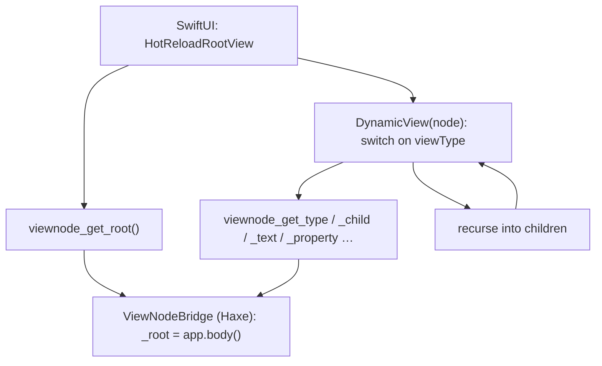
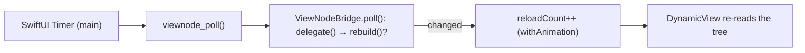

# Dynamic Renderer

The dynamic renderer walks your Haxe view tree at **runtime** and builds SwiftUI
from it, with no per-view codegen. It is how sui draws: the transpiler that read
`body()` at build time and emitted static SwiftUI is
[decommissioned](render-paths.md), behind `-D sui_static`.

That makes sui usable as a **host for a UI that isn't known at compile time**: a
hot-reload loop, or a renderer driven by a live protocol (this is how rsx2ui's
native A2UI renderer is built &mdash; a WebSocket feeds surfaces that become a
sui view tree at runtime).

It also runs an ordinary sui app, which it did not use to. Three things had to
be true for that, and each is worth knowing:

- **It draws every view sui produces.** The renderer's vocabulary was the
  protocol's &mdash; it knew `Board` and `Canvas`, and 12 of sui's 51 view
  types. A `List` or a `Picker` drew a placeholder. All of them are covered now,
  and a type outside the vocabulary is [refused at compile
  time](#what-is-refused) rather than drawn as `?Type`.
- **A state write reaches the screen.** `State.set()` rebuilds the tree, with no
  poll delegate to register. See [Reacting to state](#reacting-to-state).
- **Bindings resolve.** A sui control names its cell &mdash; `new
  TextField("Name", "userName")` &mdash; because the transpiler turned that into
  `$appState.userName`. There is no `appState` here, so the name is resolved
  against the registry every `State` joins when it is constructed.

Nothing to enable:

```bash
sui build macos
```

`--watch` is still accepted and names what already happens. `--static` opts back
in to the transpiler, which warns that it is decommissioned. Output records
which path it was built for, so switching back and forth recompiles rather than
reusing the other mode's Swift.

## Nodes with no rendering of their own

A `ViewComponent`, a `ForEach` and a `ConditionalView` are read *at compile
time* by the transpiler: a component becomes a Swift struct, a loop becomes
`ForEach(0..<n)`, a condition becomes an `if`. A walker cannot read them that
way, so `sui.nui.ViewSource` expands them before the renderer sees them &mdash;
a component into its `body()`, a loop into siblings, a condition into the branch
it selects. The renderer needs no branch for an `if`, and none for a component.

Two shapes exist only for the transpiler and cannot be resolved at runtime:

| Shape | What happens |
|---|---|
| `new ForEach(items, "i", Text.withState("{items[i].title}"))` | The body is a string template with nothing to resolve it against. No items are built, rather than putting `{items[i].title}` on screen. |
| `new ConditionalView("name", …)` where `name` is in no registry | Neither branch is taken. `false` would be a guess about half the screen. |

Prefer the closure form, `new ForEach(items, item -> …)`, and pass the cell
itself rather than its name where you can.

## Reacting to state

`sui.state.State.set()` notifies the C bridge on every application write. On the
static path that updated the generated `AppState`, an `ObservableObject` SwiftUI
was already watching. A dynamic build generates no views, so there is no
published field to write &mdash; the renderer observes those writes itself,
rebuilds the tree, and posts to the host. Rebuilds are coalesced to one per turn
of the run loop, so a handler writing three states asks for one new tree.

The poll delegate below is still there, and is still what an app streaming its
UI from elsewhere needs. An app with a fixed `body()` no longer needs one.

## Fine-grained updates

A state write used to rebuild the whole tree, for a label changing by one
character. It no longer does, and the mechanism is worth knowing because SwiftUI
cannot provide it on its own: a read that crosses a C bridge is invisible to it,
so it cannot know which view depends on which cell.

Three pieces:

1. **Values are deferred.** `sui.macros.LiveProps` rewrites a view whose value is
   computed from state — `new Text("count: " + n.get())` — into a node built with
   neutral values, carrying the real expression in `liveBuild`. Containers and
   constants are left alone.
2. **Two tiers.** Once every displayed value has moved into a thunk, what is left
   reading during `body()` is exactly what decides the tree's *shape*: a
   `ForEach`'s list, a `ConditionalView`'s condition. `sui.runtime.ReadScope`
   records the two evaluations separately, so a write can be classified. A name
   read nowhere counts as structural — rebuilding is the answer that cannot be
   wrong.
3. **One observable per cell.** Each `DynamicView` reads the cells its node
   declares, so Observation invalidates that view alone. The value itself is not
   mirrored on the Swift side: a version counter says "ask again", and two copies
   of a value are two things that can disagree.

The result, on a real runtime: writing a cell only a `Text` displays does not run
`body()` at all, and the leaf re-reads it. Writing a `ForEach`'s list runs
`body()`, because the shape changed.

A value arriving from a **control** takes the same two roads. It enters through
`State._applyFromSwift`, which deliberately does not push back to the platform
— echoing a value at the control that produced it is the loop that fights a
text field for its cursor — so the control's write-back tells the renderer
directly instead. Without that, a label reading the same cell as a text field
stayed on its old value while the field showed the new one, with nothing wrong
on the Haxe side to find.

## Seeing what it drew

macOS has no equivalent of `simctl io screenshot` or `adb screencap`. Every
outside capture needs a permission the terminal may not have: `screencapture`
wants Screen Recording, AppleScript wants Accessibility, and idb's macOS
companion answers `takeScreenshot: is not implemented`. An app, though, may
rasterise itself.

```bash
SUI_FRAME_DUMP=/tmp/frames ./build/macos/DerivedData/Build/Products/Debug/MyApp.app/Contents/MacOS/MyApp
```

Writes `frame-0000.png` at launch and one more after every state write, naming
each on stderr:

```
[sui] frame-0000.png
[sui] frame-0001.png     ← after a value write
[sui] frame-0002.png     ← after a structural write
```

So a run leaves a frame-by-frame record of what the renderer produced, which is
what you want when you cannot watch. Capped at 200 files. Unset, nothing runs.

**What it proves, and what it does not.** `ImageRenderer` rasterises the SwiftUI
hierarchy — the same `DynamicView`, built by the same renderer, from the same
live tree — but it does not read the composited window. It shows that the
renderer produced the right pixels, not that the window server showed them. On
iOS and Android, `simctl` and `adb` capture the real screen and this is not
needed.

> `cacheDisplay(in:to:)` is the wrong tool here and returns a blank sheet:
> SwiftUI does not draw into its hosting view's backing store.

## What is refused

A view type the renderer has no branch for stops the build,
naming it and listing what is covered:

```
src/MyApp.hx:32: The dynamic renderer cannot draw "Badge".
  Covered types: AdaptiveStack, AngularGradient, Board, Button, …
  Add a case to the switch in sui/runtime/DynamicView.swift.
```

The covered set is read from `DynamicView.swift` itself, so it cannot drift from
what the renderer actually draws.

## How it works

Instead of generating Swift per view, sui compiles a fixed **`DynamicView.swift`**
that walks the tree recursively through a C bridge into the running hxcpp
runtime. Your `body()` runs at runtime, produces a `View` tree, and each node is
read on demand.



Three layers:

- **`DynamicView.swift`** (framework) &mdash; the recursive renderer. A `ViewNode`
  wraps an opaque pointer to a Haxe `View`; `DynamicView` switches on its
  `viewType` and maps it to the SwiftUI equivalent, recursing into children and
  applying the modifier chain.
- **`ViewNodeBridgeC.cpp` / `.h`** (framework) &mdash; the C bridge. Each accessor
  registers the calling thread's stack with the hxcpp GC, calls the matching
  `sui.runtime.ViewNodeBridge` static through its **direct hxcpp symbol**, and
  returns a primitive or an opaque node pointer.
- **`sui.runtime.ViewNodeBridge`** (framework, Haxe) &mdash; holds the app and the
  current root, and exposes typed accessors over a `View` (`getViewType`,
  `getChildCount`, `getChild`, `getTextContent`, `getStringProperty`,
  `getModifierType`, …). It is `@:keep`: nothing in Haxe references it, so DCE
  would otherwise strip it.

## Bootstrap

The static bridge boots from `haxe_bridge_init`. The dynamic renderer instead
generates a small **`SuiBootC.cpp`** (the macro knows the concrete app class):

```cpp
extern "C" void viewnode_boot(void) {
    // hx::Boot() + __boot_all() once, then:
    auto app = ::YourApp_obj::__new();
    ::sui::runtime::ViewNodeBridge_obj::setApp(app);  // runs app.body()
}
```

`HotReloadRootView` calls `viewnode_boot()` exactly once (a lazily-initialised
Swift global) before the first traversal, so `viewnode_get_root()` always sees an
initialised runtime.

## The render loop

The tree is not static: something outside SwiftUI mutates it (a reload, an
incoming protocol message). The renderer polls on the **main thread** and
rebuilds only when something changed.



Register a poll delegate from your app; return `true` when the tree should
rebuild:

```haxe
ViewNodeBridge.setPoll(() -> myQueue.drainAndApply());  // Void -> Bool
```

`poll()` runs the delegate and calls `rebuild()` (re-invokes `app.body()`) when
it returns true. Bumps are wrapped in `withAnimation`, so with **stable node
identities** SwiftUI interpolates layout changes instead of snapping.

### Stable identity

By default a rebuild tears the tree down and rebuilds it &mdash; input focus is
lost, nothing animates. Tag each node with a `"nodeId"` property (any stable
string) and `DynamicView` uses it as the SwiftUI identity, so the framework diffs
across rebuilds: text fields keep focus, and moved elements animate.

```haxe
var v = new sui.ui.Text(label);
v.properties.set("nodeId", stableId);   // survive rebuilds
```

## Input and actions back

Two sinks let native controls and gestures report back into your Haxe app.

**Data sink** &mdash; a native input (TextField, Toggle, Slider…) writes a value
at a path:

```haxe
ViewNodeBridge.setDataSink((path, value) -> model.set(path, value));
```

sui's editable controls call `viewnode_set_data(path, value)` on change, which
routes here. Mark the node with `path`/`value` properties for the control to use.

**Action sink** &mdash; the renderer fires a named action with a JSON extra
context (e.g. a drag-and-drop drop):

```haxe
ViewNodeBridge.setActionSink((name, extraJson) -> dispatch(name, extraJson));
```

Buttons built at runtime dispatch differently: their closure sits on the live
tree (a GC root), so `viewnode_invoke_action(node)` calls it **directly** &mdash;
no id indirection, unlike the static bridge.

## Theming

A native host can take an app-provided accent (e.g. a surface's brand colour):

```haxe
ViewNodeBridge.setAccent("#7c3aed");   // hex; "" = platform default
```

`HotReloadRootView` reads it via `viewnode_theme_accent()` and applies `.tint`,
so native controls pick up the brand.

## C entrypoints

The bridge surface, all `extern "C"`:

| Function | Purpose |
|---|---|
| `viewnode_boot()` | Boot hxcpp + register the app (generated `SuiBootC.cpp`). |
| `viewnode_poll()` | Pump the poll delegate; returns 1 if the tree changed. |
| `viewnode_rebuild()` | Re-run `app.body()`. |
| `viewnode_get_root()` | Opaque pointer to the root node. |
| `viewnode_get_type` / `_child_count` / `_get_child` | Tree traversal. |
| `viewnode_get_text` / `_get_property` | Node content. |
| `viewnode_get_button_label` / `_invoke_action` | Buttons (direct dispatch). |
| `viewnode_modifier_count` / `_type` / `_float` / `_string` | Modifier chain. |
| `viewnode_set_data(path, value)` | Input edit → data sink. |
| `viewnode_fire_action(name, extraJson)` | Renderer action → action sink. |
| `viewnode_theme_accent()` | The accent to tint controls with. |

## What the build wires up

The CLI treats the app as a native-bridge build:

- compiles the hxcpp static library (`libhaxe.a`) plus `ViewNodeBridgeC.cpp` and
  the generated `SuiBootC.cpp`;
- copies `DynamicView.swift` and points `ContentView` at `HotReloadRootView`;
- emits an umbrella bridging header and the link flags.

It works without any action closures (the static bridge is suppressed in this
mode) &mdash; the ViewNode bridge and direct dispatch replace it.

> **See also:** [Render paths](render-paths.md) for why the transpiler was set
> aside and what it still wins, and [Bridge](bridge.md) for the static bridge it
> used.
