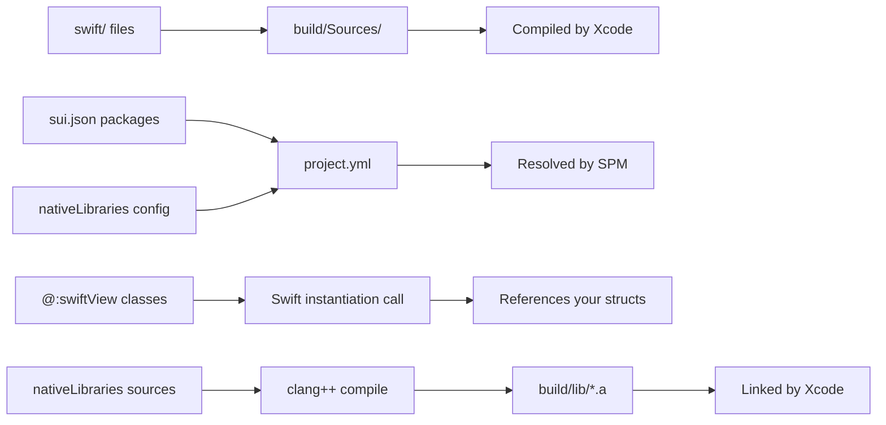

# Native Extensions

sui supports custom Swift code and Swift Package Manager dependencies alongside your Haxe app.

## Custom Swift Files

Drop `.swift` files into the `swift/` directory in your project root. They're automatically compiled into your app.

```
MyApp/
  src/
    MyApp.hx
  swift/
    MyNativeChart.swift
  build.hxml
  sui.json
```

### Example: Custom SwiftUI View

**swift/GradientCard.swift:**
```swift
import SwiftUI

struct GradientCard: View {
    let title: String

    var body: some View {
        Text(title)
            .padding()
            .frame(maxWidth: .infinity)
            .background(
                LinearGradient(
                    colors: [.blue, .purple],
                    startPoint: .leading,
                    endPoint: .trailing
                )
            )
            .foregroundColor(.white)
            .cornerRadius(12)
    }
}
```

### Referencing from Haxe

Use `@:swiftView` to create a Haxe wrapper, then use it in `body()` like any built-in view:

```haxe
@:swiftView("GradientCard")
class GradientCard extends View {
    public var title:String;
    public function new(@:swiftLabel("title") title:String) {
        super();
        this.title = title;
    }
}

class MyApp extends App {
    // ...
    override function body():View {
        return new VStack([
            new GradientCard("Welcome"),
            new GradientCard("Dashboard")
        ]);
    }
}
```

**Generated Swift:** `GradientCard(title: "Welcome")`

The `@:swiftView` class doesn't generate a Swift struct &mdash; it references the one in your `swift/` directory.

## SPM Dependencies

Declare Swift packages in `sui.json`:

```json
{
    "appName": "MyApp",
    "bundleIdentifier": "com.example.myapp",
    "bundleIdPrefix": "com.example",
    "swiftPackages": [
        {
            "url": "https://github.com/airbnb/lottie-ios",
            "from": "4.4.1",
            "product": "Lottie"
        }
    ]
}
```

Each entry needs:

| Field | Description |
|-------|-------------|
| `url` | Git URL of the Swift package |
| `from` | Minimum version (semver) |
| `product` | Product name to link |

### Using SPM Types in Custom Views

Your `swift/` files can import and use any declared package:

```swift
import SwiftUI
import Lottie

struct AnimatedLogo: View {
    var body: some View {
        LottieView(animation: .named("logo"))
            .looping()
            .frame(width: 200, height: 200)
    }
}
```

Then reference it from Haxe with `@:swiftView("AnimatedLogo")`.

## Native C/C++ Libraries

Link pre-built or source-compiled C/C++ libraries into your app using the `nativeLibraries` field in `sui.json`. This is useful for embedding inference engines, audio/video codecs, cryptography libraries, or any native code.

### Configuration

```json
{
    "appName": "MyApp",
    "bundleIdentifier": "com.example.myapp",
    "nativeLibraries": [
        {
            "name": "mylib",
            "headerSearchPaths": ["native"],
            "librarySearchPaths": ["lib/build"],
            "libraries": ["mylib"],
            "frameworks": ["Accelerate"],
            "sources": [
                {
                    "file": "native/bridge.cpp",
                    "flags": ["-std=c++17"],
                    "includePaths": ["native", "lib/include"]
                }
            ],
            "cxxInterop": true
        }
    ]
}
```

| Field | Description |
|-------|-------------|
| `name` | Library identifier (used for the compiled archive name) |
| `headerSearchPaths` | Directories containing C/C++ headers (relative to project root) |
| `librarySearchPaths` | Directories containing `.a` static libraries (relative to project root) |
| `libraries` | Library names to link (without `lib` prefix or `.a` suffix) |
| `frameworks` | System frameworks to link (e.g. `Metal`, `Accelerate`) |
| `sources` | C/C++ source files to compile during the build |
| `cxxInterop` | Enable Swift/C++ interoperability mode |

### Source Compilation

When `sources` are declared, sui compiles them with `clang++` during the build and archives the results into `build/<platform>/lib/lib<name>_native.a`. Each source entry can specify:

- `file` — path to the source file (relative to project root)
- `flags` — extra compiler flags (e.g. `["-std=c++17"]`)
- `includePaths` — header search paths for this source (relative to project root)

### Calling C/C++ from Swift

Place a C header in `swift/` to expose the native API to Swift:

**swift/MyBridgeC.h:**
```c
#ifndef MY_BRIDGE_C_H
#define MY_BRIDGE_C_H
#ifdef __cplusplus
extern "C" {
#endif

void my_init(void);
const char *my_process(const char *input);

#ifdef __cplusplus
}
#endif
#endif
```

**swift/MyClient.swift:**
```swift
import Foundation

class MyClient {
    init() {
        my_init()
    }

    func process(_ input: String) -> String {
        guard let result = my_process(input) else { return "" }
        return String(cString: result)
    }
}
```

Headers in `swift/` are automatically copied to `Sources/` alongside your Swift files.

### Example: Embedding llama.cpp

See [myai](https://github.com/pign/myai) for a complete example of embedding llama.cpp for local AI inference, with the same codebase targeting both TUI (cui) and native macOS (sui).

## How It Works



- Swift files and headers in `swift/` are copied verbatim &mdash; no code generation
- `@:swiftView` classes don't generate Swift structs &mdash; they reference yours
- SPM packages are resolved at build time by Xcode
- Native library sources are compiled by sui and linked via Xcode build settings
- Custom Swift code has full access to SwiftUI, SPM packages, native libraries, and generated app code
